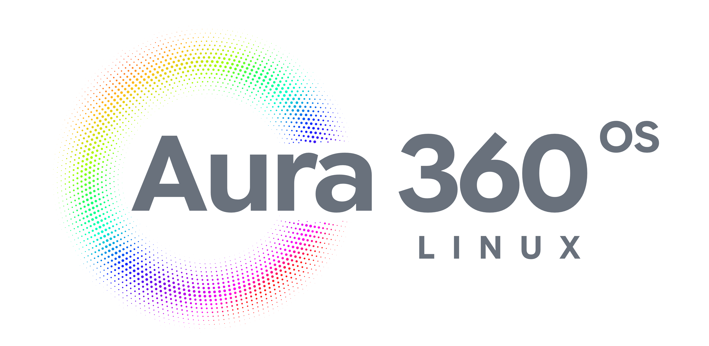

<p align="center">
  
</p>

# Aura 360 OS

**Sistema operativo Linux inmutable, mejorado y adaptado para profesionales creativos y desarrolladores.**

Diseño gráfico · Fotografía · Audio y locución · Audiovisual · Programación

Construido sobre **Bazzite DX**, Aura 360 OS está pensado para que cada una de esas
áreas trabaje con software real desde el primer arranque, sobre un sistema que se
actualiza solo, no se rompe y rinde al máximo.

---

## Auditoría: adaptado y mejorado por área profesional

### 🎨 Diseño gráfico
| Software | Rol |
|---|---|
| Krita | Pintura digital e ilustración |
| GIMP | Edición y retoque de imágenes |
| Inkscape | Vectorial y branding |
| Scribus | Maquetación y diseño editorial |
| Affinity (Photo/Designer) | Suite profesional vía Wine (helper incluido) |

Base de rendimiento: drivers NVIDIA incluidos, HDR/VRR y aceleración por GPU.

### 📷 Fotografía
| Software | Rol |
|---|---|
| Darktable | Revelado RAW profesional |
| RawTherapee | Procesado RAW avanzado |

### 🎙️ Audio y locución
- **Baja latencia real**: grupos `@audio` y `@realtime` con `rtprio 95` y memoria bloqueada ilimitada.
- **CPU en modo `performance`** automático al arrancar (servicio propio `aura-performance.service`).
- Software: **Ardour** (DAW profesional), **Audacity** (grabación y edición de voz), PipeWire moderno.
- Opcional documentado: plugins VST de Windows vía Wine/Yabridge (patrón caracal).

### 🎬 Audiovisual
| Software | Rol |
|---|---|
| DaVinci Resolve | Edición y etalonaje profesional (binario oficial en contenedor davincibox) |
| Kdenlive | Edición de video no lineal |
| OBS Studio | Captura y streaming (con VkCapture) |

### 💻 Programación
Hereda el stack completo de Bazzite DX: **VS Code, Docker CE, QEMU/KVM, Distrobox,
Podman, bpftrace, sysprof y ROCm**.

---

## Por qué es un sistema mejorado y adaptado
- **Inmutable y atómico**: las actualizaciones son reversibles; el sistema no se rompe.
- **Siempre actualizado**: se actualiza solo (modelo heredado de Bazzite).
- **Rendimiento**: kernel OGC (parches de gaming/fsync), governor `performance`, NVIDIA lista de fábrica.
- **Cero configuración creativa**: suite de 10 aplicaciones preinstalada automáticamente en el primer arranque.

## Qué añade sobre Bazzite DX
| Capa | Contenido |
|---|---|
| Audio pro | Límites realtime (`rtprio 95`) + governor CPU `performance` |
| Suite creativa | Krita, GIMP, Inkscape, Blender, Kdenlive, Ardour, Audacity, Darktable, RawTherapee, Scribus (Flatpak automático) |
| Heredado de Bazzite | DaVinci Resolve y Affinity vía helpers `ujust`, OBS VkCapture, códecs, NVIDIA |

## Cómo instalar

```bash
# Variante NVIDIA (recomendada para DaVinci Resolve)
rpm-ostree rebase ostree-unverified-registry:ghcr.io/arielingo/aura360-os:latest

# Variante AMD/Intel
rpm-ostree rebase ostree-unverified-registry:ghcr.io/arielingo/aura360-os-open:latest

systemctl reboot
```

Guías: [Instalación y primer arranque](docs/INSTALL.md) · [Dual boot con Windows](docs/DUALBOOT.md)

## Estado de verificación
- ✅ Imagen compilada y publicada automáticamente (GitHub Actions).
- ✅ Configuración verificada contra fuentes primarias (Bazzite DX, caracal, davincibox, BlueBuild).
- ⏳ Prueba en hardware real pendiente (primer arranque en tu equipo).

## Créditos y bases
- Bazzite / Bazzite DX — https://github.com/ublue-os/bazzite · https://github.com/ublue-os/bazzite-dx
- caracal (patrón de audio profesional) — https://github.com/caracal-dev/caracal
- davincibox (DaVinci Resolve en contenedor) — https://github.com/zelikos/davincibox
- BlueBuild (plantilla de construcción) — https://github.com/blue-build/template

## Licencia
Apache-2.0
